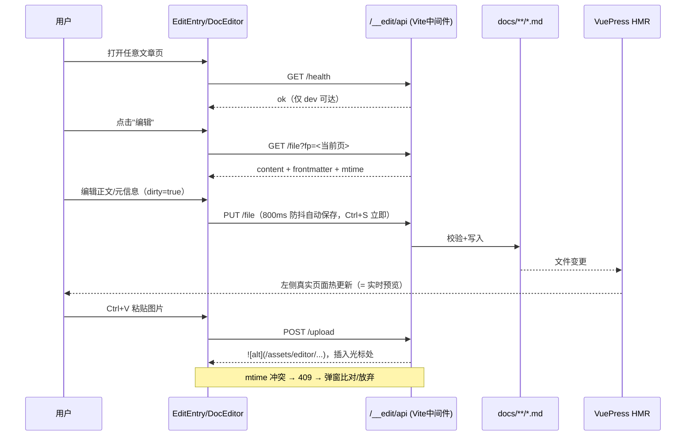

# 知识内容本地编辑功能 — 设计与实施计划

> 状态：待确认 → 分期实施
> 需求确认结论（2026-09-12）：本地页面内编辑器形态；首期覆盖 正文编辑与实时预览、新建/删除页面、frontmatter 元信息、图片上传/粘贴；仅本地 dev 环境使用。
> 文档纪律：后续迭代与实施记录追加在本文档，不另开新文档；仅当开启全新问题时才新建。

---

## 一、背景与目标

JavaGuide 是基于 VuePress 2 + vuepress-theme-hope 的纯静态站点：运行时无后端，全部知识内容为 `docs/**/*.md` 源文件，主配置为 `docs/.vuepress/config.ts`（viteBundler），侧边栏为手写的 `docs/.vuepress/sidebar/*.ts`。

**目标**：在本地 dev 环境浏览站点时，可直接在页面内编辑当前文章的 Markdown 正文与 frontmatter，保存写回源文件并借助 VuePress HMR 即时看到真实渲染效果；支持新建/删除页面与图片上传。生产构建产物保持纯静态、物理上不包含任何编辑能力。

**非目标**：多用户/线上编辑、鉴权体系、git 提交集成（写文件后由现有 git 工作流兜底）。

---

## 二、总体架构

```
┌────────────────────────── 浏览器（localhost） ──────────────────────────┐
│  VuePress 客户端                                                        │
│  ├─ EditEntry.vue（浮动按钮，GET /__edit/api/health 探测后才渲染）        │
│  └─ DocEditor 抽屉（defineAsyncComponent 懒加载）                        │
│      ├─ MarkdownEditor.vue（CodeMirror 6）                              │
│      ├─ FrontmatterForm.vue（js-yaml 表单）                             │
│      ├─ NewPageDialog.vue / 删除确认（输入文件名二次确认）                 │
│      └─ useDocEditor()（模块级 reactive 单例状态）                        │
└──────────────┬─────────────────────────────────────────────┬──────────┘
               │ 同源 fetch /__edit/api/*                     │
┌──────────────▼─────────────────────────────────────────────▼──────────┐
│  vuepress dev 进程（Vite DevServer）                                    │
│  └─ docsEditPlugin()（自定义 Vite 插件, apply:'serve'）                  │
│      ├─ configureServer: 注册 /__edit/api/* 中间件                      │
│      ├─ define: __EDIT_ENABLED__ 注入客户端                              │
│      └─ 文件读写：docs/**/*.md、.vuepress/public/assets/editor/          │
└──────────────┬────────────────────────────────────────────────────────┘
               │ fs 写入 → VuePress 文件监听
               ▼
        HMR 热更新 = 实时预览（左侧真实页面即预览区）
```

**核心架构决策：编辑服务做成 Vite 插件中间件，跑在 vuepress dev 同一进程、同一端口。**

| 备选方案                       | 结论             | 理由                                                                                                                           |
| ------------------------------ | ---------------- | ------------------------------------------------------------------------------------------------------------------------------ |
| Vite 插件中间件（选定）        | ✅               | 同端口同源无 CORS；`apply: 'serve'` 使 `vuepress build` 产物物理上不含 API，"仅本地使用"由架构保证而非配置约束；无额外进程管理 |
| 独立 Express 进程 + vite proxy | ❌               | 多进程生命周期/端口冲突管理成本；代理配置易与 HMR websocket 冲突                                                               |
| 纯前端 localStorage 笔记层     | ❌               | 不满足"写回源文件"的核心诉求                                                                                                   |
| 生产环境也可用                 | ❌（用户已排除） | 需鉴权、git 流程，复杂度与安全风险不成比例                                                                                     |

---

## 三、技术选型与理由

| 依赖                 | 用途                    | 选择理由                                                                            | 备选与弃用原因                                              |
| -------------------- | ----------------------- | ----------------------------------------------------------------------------------- | ----------------------------------------------------------- |
| CodeMirror 6         | Markdown 编辑器         | 体积可控（tree-shaking）、中文 IME 支持成熟、markdown 语法高亮/列编辑/撤销栈完整    | Monaco（>2MB 过重）；原生 textarea（无高亮、撤销栈差）      |
| js-yaml              | frontmatter 解析/序列化 | 事实标准、浏览器端可用                                                              | gray-matter（Node 侧，客户端不可用）                        |
| pinyin-pro           | 新建页文件名 slug       | 中文标题 → 英文 slug，规避中文 URL 编码问题（约 30KB，仅新建页对话框懒加载）        | 保留中文文件名（可用但 URL 百分号编码难看、git/终端不友好） |
| 无 Pinia             | 状态管理                | VuePress 客户端未引入 Pinia，单编辑器场景用模块级 `reactive` 单例即可，避免新增依赖 | —                                                           |
| defineAsyncComponent | 编辑器懒加载            | 保证编辑相关依赖（CM6 等）不进入站点首屏 bundle                                     | —                                                           |

**关键取舍 —— 实时预览不自建 markdown-it 渲染**：JavaGuide 大量使用自定义容器、Shiki 代码高亮、图表插件，客户端复刻渲染管线必然与主题产生漂移。改为「保存驱动 HMR 预览」：编辑抽屉占右侧约 45% 宽，左侧仍是真实页面，防抖自动保存后 VuePress 热更新直接呈现最终渲染，预览 = 真实结果，零漂移、零额外渲染代码。

---

## 四、拟实现组件/模块清单

### 服务端（Node，仅 dev 生效）

| 文件                                      | 状态 | 职责                                                                                                                            |
| ----------------------------------------- | ---- | ------------------------------------------------------------------------------------------------------------------------------- |
| `docs/.vuepress/edit-plugin/index.ts`     | 新增 | Vite 插件入口：`apply:'serve'`、`configureServer` 注册中间件、`define` 注入 `__EDIT_ENABLED__`                                  |
| `docs/.vuepress/edit-plugin/api.ts`       | 新增 | 各 API 路由实现（读写/新建/删除/上传/dirs）                                                                                     |
| `docs/.vuepress/edit-plugin/guard.ts`     | 新增 | 安全守卫：路径解析与白名单、扩展名校验、图片 magic bytes、大小限制                                                              |
| `docs/.vuepress/edit-plugin/constants.ts` | 新增 | `DOCS_ROOT`、`API_PREFIX='/__edit/api'`、`MAX_MD_BYTES`、`MAX_IMAGE_BYTES`、`EDITOR_ASSETS_DIR`、`TRASH_DIR` 等，禁止散落硬编码 |
| `docs/.vuepress/config.ts`                | 修改 | `viteBundler({ viteOptions: { plugins: [docsEditPlugin()] } })` 一行接入                                                        |

### API 设计（REST，前缀 `/__edit/api`）

| 方法   | 路径                          | 请求                             | 响应/语义                                                                  |
| ------ | ----------------------------- | -------------------------------- | -------------------------------------------------------------------------- |
| GET    | `/health`                     | —                                | `{ ok, version }`；客户端据此显示/隐藏入口                                 |
| GET    | `/file?fp=<filePathRelative>` | —                                | `{ content, frontmatter, mtime }`                                          |
| PUT    | `/file`                       | `{ fp, content, baseMtime }`     | 写回源文件；`baseMtime` 不一致返回 409（多标签页冲突保护）                 |
| POST   | `/page`                       | `{ dir, slug, title, template }` | 新建 .md（frontmatter 模板）；返回新路径                                   |
| DELETE | `/file?fp=`                   | —                                | **移入回收站** `docs/.vuepress/.edit-trash/<timestamp>/`，非硬删           |
| GET    | `/dirs`                       | —                                | 可用文档目录树（新建页选择器数据源）                                       |
| POST   | `/upload`                     | `{ dir, filename, base64 }`      | 图片落盘 `.vuepress/public/assets/editor/YYYY/MM/`，返回 Markdown 引用片段 |

> `fp` 一律使用 VuePress 客户端 `pageData.filePathRelative`（相对 docs 根），传输时 `encodeURIComponent`，服务端 resolve 后做白名单校验。

### 客户端（浏览器）

| 文件                                       | 状态 | 职责                                                                  |
| ------------------------------------------ | ---- | --------------------------------------------------------------------- |
| `components/EditEntry.vue`                 | 新增 | 右下角浮动按钮；health 探测通过才渲染；点击打开编辑抽屉               |
| `components/DocEditor/DocEditor.vue`       | 新增 | 抽屉容器（约 45% 宽，可全屏切换）；编排子组件；保存/冲突/脏状态提示条 |
| `components/DocEditor/MarkdownEditor.vue`  | 新增 | CodeMirror 6 封装；粘贴图片拦截 → 上传 → 光标处插入引用               |
| `components/DocEditor/FrontmatterForm.vue` | 新增 | title/icon/date/category/tag/order/sticky/star 等常用键的表单化编辑   |
| `components/DocEditor/NewPageDialog.vue`   | 新增 | 目录选择（/dirs）+ 标题 → slug + 模板选择 + sidebar 挂载引导          |
| `components/docEditorState.ts`             | 新增 | `useDocEditor()` 单例状态 + 全部常量（面板宽度、防抖间隔、存储键）    |
| `client.ts`                                | 修改 | 注册 `EditEntry`（编辑器主体由其内部懒加载，不影响首屏）              |

---

## 五、数据流与时序



新建/删除流程：`NewPageDialog → POST /page → router.push(新页) → 打开编辑器`；删除为「输入文件名确认 → DELETE → 移入回收站 → 跳首页 + toast」。

---

## 六、状态管理方案

- 模块级 `reactive` 单例（`docEditorState.ts`）：`{ open, activeFp, content, frontmatter, baseMtime, dirty, saving, conflict, autosaveOn, health }`，跨组件共享且不随路由销毁（切页时若有未保存改动 → 拦截提示）。
- 会话内草稿兜底：编辑期间将内容快照写入 `sessionStorage`（键 `doc-editor-draft:<fp>`），保存成功即清除——防浏览器崩溃丢稿。
- 服务端无状态：每次请求自包含（fp + 内容 + mtime），不做内存会话。

---

## 七、安全与校验（dev-only 也必须做）

1. **路径穿越防线**：`fp` 经 `path.resolve(DOCS_ROOT, fp)` 后必须 `startsWith(DOCS_ROOT + sep)`，且扩展名 ∈ {`.md`}；拒绝 `.vuepress/**`、`node_modules/**`、`.edit-trash/**`。
2. **仅本地**：Vite dev server 默认绑定 loopback；中间件内再校验 `req.socket.remoteAddress` 为回环地址。
3. **图片校验**：magic bytes 白名单（png/jpg/gif/webp；svg 因 XSS 风险默认禁用或净化）、≤10MB、文件名 `[A-Za-z0-9_-]`（中文名自动转 slug）。
4. **体积限制**：md ≤ 2MB，请求体超限直接 413。
5. **删除保护**：二次确认（输入文件名）+ 回收站可恢复；回收站目录以 `.` 开头且被 `pagePatterns` 的 `!.vuepress` 排除，不会变成站点页面。
6. **产物纯净性验收**：`pnpm docs:build` 后在 `dist/` 中 grep `__edit/api` 必须为 0 命中。

---

## 八、分期实施计划与验收标准

> 每期结束：自回归测试 → 用户验收关键节点 → 实施记录追加至本文档；确认通过后再进入下一期。

### P1 编辑骨架（核心闭环）

- 内容：edit-plugin（health/GET/PUT）+ EditEntry 浮动按钮 + CodeMirror 正文编辑 + 防抖自动保存 + HMR 实时预览 + 脏状态/冲突(409)处理。
- 验收：① 页面内改文字，源文件 git diff 正确；② 左侧页面 ≤2s 内热更新；③ 刷新后重新打开编辑器内容一致；④ `docs:build` 产物 grep 不到 API 且浮动按钮不出现。

### P2 frontmatter + 页面生命周期

- 内容：FrontmatterForm、新建页（模板+slug）/删除页（回收站）、`/dirs`、sidebar 挂载引导。
- 验收：① 改 title/category 后页面与侧边栏正确变化；② 新建页可访问、删除页后原路由 404、回收站可手工还原；③ 新建页有清晰的侧边栏挂载引导。

### P3 图片能力

- 内容：上传/粘贴、目录归档（YYYY/MM）、类型与大小校验、文件名规范化。
- 验收：① 粘贴截图自动插入引用且页面内正常显示；② 伪造扩展名（如 .exe 改 .png）被 magic bytes 拦截。

### P4 收尾

- 内容：自回归清单全量执行、安全自查（路径穿越/超限/并发写）、使用说明文档（本文档追加"使用指南"章节）、代码 Review（TRAE-code-review）。
- 验收：清单全绿 + 构建纯净性复验。

---

## 九、潜在难点与风险对策

| 风险                                              | 影响         | 对策                                                                                                                                     |
| ------------------------------------------------- | ------------ | ---------------------------------------------------------------------------------------------------------------------------------------- |
| 自动保存高频写盘 → HMR 频繁重编译、编辑卡顿       | 体验         | 800ms 防抖 + 自动保存可开关；VuePress 对 md 变更做页面级 HMR，通常无整页刷新                                                             |
| **手写侧边栏（sidebar/\*.ts）不会自动收录新页**   | 新页"不可见" | v1：新建成功后给出"应挂载到哪个 sidebar 文件"的引导 + 待插入链接一键复制；v2 评估结构化插入 sidebar ts（AST 修改风险高，需单独立项验证） |
| frontmatter 注释/格式在 js-yaml round-trip 中丢失 | 内容         | JavaGuide frontmatter 实际无注释，v1 接受；v2 做按键级"手术式"替换保留原文格式                                                           |
| 中文文件名 → URL 百分号编码、路由跳转坑           | 体验         | API 全程 `filePathRelative` + encodeURIComponent（前期字体功能已踩过中文 URL 坑）；新建页默认英文 slug                                   |
| 多标签页同时编辑同一文件                          | 数据         | mtime 乐观锁（baseMtime），409 时提供"以我的为准覆盖 / 重新加载"选择                                                                     |
| 误改/误删                                         | 数据         | git 兜底 + 回收站 + 删除输入文件名确认 + session 草稿                                                                                    |
| CodeMirror 中文 IME 组合期误触发保存/粘贴         | 体验         | CM6 原生处理 composition 事件；自回归专项用例                                                                                            |
| 页面路径 ≠ 文件路径（permalink 重写）             | 定位         | 一律以 `pageData.filePathRelative` 为准，不猜路由映射                                                                                    |

---

## 十、待确认事项（已确认 2026-09-12）

1. 编辑抽屉默认 45% 宽（左页右编辑）→ ✅ 按推荐默认执行
2. 自动保存默认开启（可关）→ ✅ 按推荐默认执行
3. 新建页的 sidebar 处理，v1 采用"引导 + 一键复制"→ ✅ 按推荐默认执行

---

## 十一、实施记录

### P1 编辑骨架（2026-09-12 完成 ✅）

#### 实际交付文件

| 文件                                                     | 说明                                                                                                                                              |
| -------------------------------------------------------- | ------------------------------------------------------------------------------------------------------------------------------------------------- |
| `docs/.vuepress/edit-plugin/constants.ts`                | 全部服务端常量（DOCS_ROOT/API_PREFIX/体积上限/禁区目录等），无散落硬编码                                                                          |
| `docs/.vuepress/edit-plugin/guard.ts`                    | 路径穿越四重防线（格式白名单/resolve 越界/扩展名/禁区段）+ 运行环境校验                                                                           |
| `docs/.vuepress/edit-plugin/api.ts`                      | 中间件与路由表：GET /health、GET /file、PUT /file（mtime 乐观锁 + force 覆盖 + 413/409/400 语义）                                                 |
| `docs/.vuepress/edit-plugin/index.ts`                    | Vite 插件入口：`apply:'serve'` + `configureServer` + `define` 注入                                                                                |
| `docs/.vuepress/config.ts`                               | `viteOptions.plugins: [docsEditPlugin()]` 一行接入                                                                                                |
| `docs/.vuepress/components/docEditorState.ts`            | 模块级 reactive 单例状态 + ApiError + fetch/save + sessionStorage 草稿 + 自动保存偏好持久化                                                       |
| `docs/.vuepress/components/EditEntry.vue`                | 右下角浮动按钮：health 探活（30s 低频重试）→ 显示；懒加载 DocEditor（ref 就绪轮询）                                                               |
| `docs/.vuepress/components/DocEditor/DocEditor.vue`      | 45% 抽屉（可全屏/小屏自适应）：防抖自动保存、脏点、冲突横幅（覆盖/重载）、错误横幅、草稿恢复横幅、状态栏、Ctrl+S、路由切换冲刷、beforeunload 拦截 |
| `docs/.vuepress/components/DocEditor/MarkdownEditor.vue` | CodeMirror 6 封装：basicSetup + markdown 语言 + Mod-s 拦截 + 外部内容同步防回环                                                                   |
| `docs/.vuepress/client.ts`                               | 注册 EditEntry 为 root component                                                                                                                  |

#### 与计划的三处调整（均已在实现中验证）

1. **P1 直接编辑完整源文（含 frontmatter 文本）**，而非仅正文：CM6 中 frontmatter 以 YAML 文本呈现，无损编辑，规避了"拆分/回拼 frontmatter"的格式漂移风险；P2 的 FrontmatterForm 在此基础上做按键级表单化。
2. **API 路径改由 `define` 注入（`__EDIT_API_BASE__`，仅 dev 存在）**：首版客户端硬编码 `/__edit/api`，`docs:build` 产物 grep 命中（验收④不达标）。改为 serve-only define + `typeof` 守卫后，产物物理上不含该路径字符串；prod 中 API_BASE=null → 入口永久隐藏、不发探测。注：产物中残留 `typeof __EDIT_API_BASE__` 标识符（无路径信息、无能力，仅特性名），可接受。
3. **GET /file 返回 `{ content, mtime }`**（暂不含 frontmatter 结构化字段）：与第 1 点对应，P2 引入表单时再扩展。

#### 自回归结果（P1 验收标准全过）

| 项                                    | 结果                                                                                                         |
| ------------------------------------- | ------------------------------------------------------------------------------------------------------------ |
| ① 页面内改文字 → 源文件 git diff 正确 | ✅ 插入标记写入磁盘正确位置；删除后 diff 完全干净（含末尾换行还原）                                          |
| ② 左侧页面 ≤2s 热更新                 | ✅ 自动保存写入后 `hmr update /javaguide/intro.md`，页面出现新内容                                           |
| ③ 重新打开编辑器内容一致              | ✅ 关闭→重开显示已保存内容（注意：CM 虚拟滚动下 textContent 仅含视口行，验证需滚动）                         |
| ④ 构建产物纯净性                      | ✅ `docs:build` 成功；dist 全量 grep `__edit/api` = 0 命中                                                   |
| API 冒烟                              | ✅ health/GET/PUT 正常；错误 baseMtime → 409+serverMtime；force → 200；路径穿越/`.vuepress`/非 .md → 400/404 |
| 路由切换冲刷                          | ✅ 有未保存改动时点击侧边栏链接，旧页改动先保存（"已保存"）再加载新页内容                                    |
| 服务端守卫                            | ✅ 回环地址校验内置（server 绑定 0.0.0.0 时防局域网访问）；本机访问正常                                      |

#### 过程问题与修复

- `@codemirror/commands`/`state`/`view` 未在根项目声明（pnpm 严格模式传递依赖不可直接导入）→ Vite 500 → 补充为 devDependencies。
- 异步组件 ref 就绪前 `open()` 被可选链静默跳过 → 抽屉空壳 → 改为轮询等待 ref（上限约 3s）。
- 抽屉 `aside` 未受 `state.open` 控制导致关闭无效 → 补 `v-if`。
- 测试方法论坑：CM 虚拟滚动使 `cm-content.textContent` 只含视口行；`selectNodeContents+collapse(false)` 的光标落在视口末尾而非文档末尾 → 用 Ctrl+End 定位真实文档末尾。

#### 遗留与后续

- 冲突(409) UI 流程已实现但仅做了 API 级验证，双标签页 UI 级实测放 P4 自回归清单。
- CM 默认亮色主题在站点暗色模式下观感割裂 → P4 打磨（基于 vp CSS 变量的 HighlightStyle）。
- P2：FrontmatterForm、新建/删除页（回收站）、`/dirs`、sidebar 挂载引导（一键复制）。
