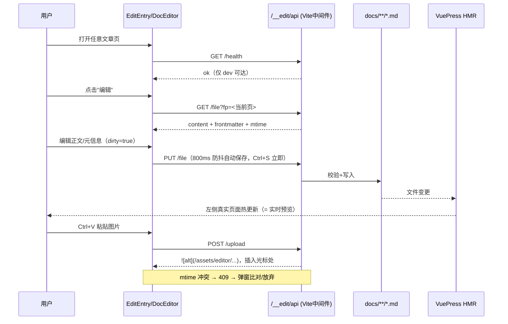

# 知识内容本地编辑功能 — 设计与实施计划

> 状态：待确认 → 分期实施
> 需求确认结论（2026-09-12）：本地页面内编辑器形态；首期覆盖 正文编辑与实时预览、新建/删除页面、frontmatter 元信息、图片上传/粘贴；仅本地 dev 环境使用。
> 文档纪律：后续迭代与实施记录追加在本文档，不另开新文档；仅当开启全新问题时才新建。

---

## 一、背景与目标

JavaGuide 是基于 VuePress 2 + vuepress-theme-hope 的纯静态站点：运行时无后端，全部知识内容为 `docs/**/*.md` 源文件，主配置为 `docs/.vuepress/config.ts`（viteBundler），侧边栏为手写的 `docs/.vuepress/sidebar/*.ts`。

**目标**：在本地 dev 环境浏览站点时，可直接在页面内编辑当前文章的 Markdown 正文与 frontmatter，保存写回源文件并借助 VuePress HMR 即时看到真实渲染效果；支持新建/删除页面与图片上传。生产构建产物保持纯静态、物理上不包含任何编辑能力。

**非目标**：多用户/线上编辑、鉴权体系、git 提交集成（写文件后由现有 git 工作流兜底）。

---

## 二、总体架构

```
┌────────────────────────── 浏览器（localhost） ──────────────────────────┐
│  VuePress 客户端                                                        │
│  ├─ EditEntry.vue（浮动按钮，GET /__edit/api/health 探测后才渲染）        │
│  └─ DocEditor 抽屉（defineAsyncComponent 懒加载）                        │
│      ├─ MarkdownEditor.vue（CodeMirror 6）                              │
│      ├─ FrontmatterForm.vue（js-yaml 表单）                             │
│      ├─ NewPageDialog.vue / 删除确认（输入文件名二次确认）                 │
│      └─ useDocEditor()（模块级 reactive 单例状态）                        │
└──────────────┬─────────────────────────────────────────────┬──────────┘
               │ 同源 fetch /__edit/api/*                     │
┌──────────────▼─────────────────────────────────────────────▼──────────┐
│  vuepress dev 进程（Vite DevServer）                                    │
│  └─ docsEditPlugin()（自定义 Vite 插件, apply:'serve'）                  │
│      ├─ configureServer: 注册 /__edit/api/* 中间件                      │
│      ├─ define: __EDIT_ENABLED__ 注入客户端                              │
│      └─ 文件读写：docs/**/*.md、.vuepress/public/assets/editor/          │
└──────────────┬────────────────────────────────────────────────────────┘
               │ fs 写入 → VuePress 文件监听
               ▼
        HMR 热更新 = 实时预览（左侧真实页面即预览区）
```

**核心架构决策：编辑服务做成 Vite 插件中间件，跑在 vuepress dev 同一进程、同一端口。**

| 备选方案                       | 结论             | 理由                                                                                                                           |
| ------------------------------ | ---------------- | ------------------------------------------------------------------------------------------------------------------------------ |
| Vite 插件中间件（选定）        | ✅               | 同端口同源无 CORS；`apply: 'serve'` 使 `vuepress build` 产物物理上不含 API，"仅本地使用"由架构保证而非配置约束；无额外进程管理 |
| 独立 Express 进程 + vite proxy | ❌               | 多进程生命周期/端口冲突管理成本；代理配置易与 HMR websocket 冲突                                                               |
| 纯前端 localStorage 笔记层     | ❌               | 不满足"写回源文件"的核心诉求                                                                                                   |
| 生产环境也可用                 | ❌（用户已排除） | 需鉴权、git 流程，复杂度与安全风险不成比例                                                                                     |

---

## 三、技术选型与理由

| 依赖                 | 用途                    | 选择理由                                                                            | 备选与弃用原因                                              |
| -------------------- | ----------------------- | ----------------------------------------------------------------------------------- | ----------------------------------------------------------- |
| CodeMirror 6         | Markdown 编辑器         | 体积可控（tree-shaking）、中文 IME 支持成熟、markdown 语法高亮/列编辑/撤销栈完整    | Monaco（>2MB 过重）；原生 textarea（无高亮、撤销栈差）      |
| js-yaml              | frontmatter 解析/序列化 | 事实标准、浏览器端可用                                                              | gray-matter（Node 侧，客户端不可用）                        |
| pinyin-pro           | 新建页文件名 slug       | 中文标题 → 英文 slug，规避中文 URL 编码问题（约 30KB，仅新建页对话框懒加载）        | 保留中文文件名（可用但 URL 百分号编码难看、git/终端不友好） |
| 无 Pinia             | 状态管理                | VuePress 客户端未引入 Pinia，单编辑器场景用模块级 `reactive` 单例即可，避免新增依赖 | —                                                           |
| defineAsyncComponent | 编辑器懒加载            | 保证编辑相关依赖（CM6 等）不进入站点首屏 bundle                                     | —                                                           |

**关键取舍 —— 实时预览不自建 markdown-it 渲染**：JavaGuide 大量使用自定义容器、Shiki 代码高亮、图表插件，客户端复刻渲染管线必然与主题产生漂移。改为「保存驱动 HMR 预览」：编辑抽屉占右侧约 45% 宽，左侧仍是真实页面，防抖自动保存后 VuePress 热更新直接呈现最终渲染，预览 = 真实结果，零漂移、零额外渲染代码。

---

## 四、拟实现组件/模块清单

### 服务端（Node，仅 dev 生效）

| 文件                                      | 状态 | 职责                                                                                                                            |
| ----------------------------------------- | ---- | ------------------------------------------------------------------------------------------------------------------------------- |
| `docs/.vuepress/edit-plugin/index.ts`     | 新增 | Vite 插件入口：`apply:'serve'`、`configureServer` 注册中间件、`define` 注入 `__EDIT_ENABLED__`                                  |
| `docs/.vuepress/edit-plugin/api.ts`       | 新增 | 各 API 路由实现（读写/新建/删除/上传/dirs）                                                                                     |
| `docs/.vuepress/edit-plugin/guard.ts`     | 新增 | 安全守卫：路径解析与白名单、扩展名校验、图片 magic bytes、大小限制                                                              |
| `docs/.vuepress/edit-plugin/constants.ts` | 新增 | `DOCS_ROOT`、`API_PREFIX='/__edit/api'`、`MAX_MD_BYTES`、`MAX_IMAGE_BYTES`、`EDITOR_ASSETS_DIR`、`TRASH_DIR` 等，禁止散落硬编码 |
| `docs/.vuepress/config.ts`                | 修改 | `viteBundler({ viteOptions: { plugins: [docsEditPlugin()] } })` 一行接入                                                        |

### API 设计（REST，前缀 `/__edit/api`）

| 方法   | 路径                          | 请求                             | 响应/语义                                                                  |
| ------ | ----------------------------- | -------------------------------- | -------------------------------------------------------------------------- |
| GET    | `/health`                     | —                                | `{ ok, version }`；客户端据此显示/隐藏入口                                 |
| GET    | `/file?fp=<filePathRelative>` | —                                | `{ content, frontmatter, mtime }`                                          |
| PUT    | `/file`                       | `{ fp, content, baseMtime }`     | 写回源文件；`baseMtime` 不一致返回 409（多标签页冲突保护）                 |
| POST   | `/page`                       | `{ dir, slug, title, template }` | 新建 .md（frontmatter 模板）；返回新路径                                   |
| DELETE | `/file?fp=`                   | —                                | **移入回收站** `docs/.vuepress/.edit-trash/<timestamp>/`，非硬删           |
| GET    | `/dirs`                       | —                                | 可用文档目录树（新建页选择器数据源）                                       |
| POST   | `/upload`                     | `{ dir, filename, base64 }`      | 图片落盘 `.vuepress/public/assets/editor/YYYY/MM/`，返回 Markdown 引用片段 |

> `fp` 一律使用 VuePress 客户端 `pageData.filePathRelative`（相对 docs 根），传输时 `encodeURIComponent`，服务端 resolve 后做白名单校验。

### 客户端（浏览器）

| 文件                                       | 状态 | 职责                                                                  |
| ------------------------------------------ | ---- | --------------------------------------------------------------------- |
| `components/EditEntry.vue`                 | 新增 | 右下角浮动按钮；health 探测通过才渲染；点击打开编辑抽屉               |
| `components/DocEditor/DocEditor.vue`       | 新增 | 抽屉容器（约 45% 宽，可全屏切换）；编排子组件；保存/冲突/脏状态提示条 |
| `components/DocEditor/MarkdownEditor.vue`  | 新增 | CodeMirror 6 封装；粘贴图片拦截 → 上传 → 光标处插入引用               |
| `components/DocEditor/FrontmatterForm.vue` | 新增 | title/icon/date/category/tag/order/sticky/star 等常用键的表单化编辑   |
| `components/DocEditor/NewPageDialog.vue`   | 新增 | 目录选择（/dirs）+ 标题 → slug + 模板选择 + sidebar 挂载引导          |
| `components/docEditorState.ts`             | 新增 | `useDocEditor()` 单例状态 + 全部常量（面板宽度、防抖间隔、存储键）    |
| `client.ts`                                | 修改 | 注册 `EditEntry`（编辑器主体由其内部懒加载，不影响首屏）              |

---

## 五、数据流与时序


```mermaid
sequenceDiagram
    participant U as 用户
    participant E as EditEntry/DocEditor
    participant API as /__edit/api (Vite中间件)
    participant FS as docs/**/*.md
    participant VP as VuePress HMR

    U->>E: 打开任意文章页
    E->>API: GET /health
    API-->>E: ok（仅 dev 可达）
    U->>E: 点击"编辑"
    E->>API: GET /file?fp=<当前页>
    API-->>E: content + frontmatter + mtime
    U->>E: 编辑正文/元信息（dirty=true）
    E->>API: PUT /file（800ms 防抖自动保存，Ctrl+S 立即）
    API->>FS: 校验+写入
    FS-->>VP: 文件变更
    VP-->>U: 左侧真实页面热更新（= 实时预览）
    U->>E: Ctrl+V 粘贴图片
    E->>API: POST /upload
    API-->>E: ![alt](/assets/editor/...)，插入光标处
    Note over E,API: mtime 冲突 → 409 → 弹窗比对/放弃
```

新建/删除流程：`NewPageDialog → POST /page → router.push(新页) → 打开编辑器`；删除为「输入文件名确认 → DELETE → 移入回收站 → 跳首页 + toast」。

---

## 六、状态管理方案

- 模块级 `reactive` 单例（`docEditorState.ts`）：`{ open, activeFp, content, frontmatter, baseMtime, dirty, saving, conflict, autosaveOn, health }`，跨组件共享且不随路由销毁（切页时若有未保存改动 → 拦截提示）。
- 会话内草稿兜底：编辑期间将内容快照写入 `sessionStorage`（键 `doc-editor-draft:<fp>`），保存成功即清除——防浏览器崩溃丢稿。
- 服务端无状态：每次请求自包含（fp + 内容 + mtime），不做内存会话。

---

## 七、安全与校验（dev-only 也必须做）

1. **路径穿越防线**：`fp` 经 `path.resolve(DOCS_ROOT, fp)` 后必须 `startsWith(DOCS_ROOT + sep)`，且扩展名 ∈ {`.md`}；拒绝 `.vuepress/**`、`node_modules/**`、`.edit-trash/**`。
2. **仅本地**：Vite dev server 默认绑定 loopback；中间件内再校验 `req.socket.remoteAddress` 为回环地址。
3. **图片校验**：magic bytes 白名单（png/jpg/gif/webp；svg 因 XSS 风险默认禁用或净化）、≤10MB、文件名 `[A-Za-z0-9_-]`（中文名自动转 slug）。
4. **体积限制**：md ≤ 2MB，请求体超限直接 413。
5. **删除保护**：二次确认（输入文件名）+ 回收站可恢复；回收站目录以 `.` 开头且被 `pagePatterns` 的 `!.vuepress` 排除，不会变成站点页面。
6. **产物纯净性验收**：`pnpm docs:build` 后在 `dist/` 中 grep `__edit/api` 必须为 0 命中。

---

## 八、分期实施计划与验收标准

> 每期结束：自回归测试 → 用户验收关键节点 → 实施记录追加至本文档；确认通过后再进入下一期。

### P1 编辑骨架（核心闭环）

- 内容：edit-plugin（health/GET/PUT）+ EditEntry 浮动按钮 + CodeMirror 正文编辑 + 防抖自动保存 + HMR 实时预览 + 脏状态/冲突(409)处理。
- 验收：① 页面内改文字，源文件 git diff 正确；② 左侧页面 ≤2s 内热更新；③ 刷新后重新打开编辑器内容一致；④ `docs:build` 产物 grep 不到 API 且浮动按钮不出现。

### P2 frontmatter + 页面生命周期

- 内容：FrontmatterForm、新建页（模板+slug）/删除页（回收站）、`/dirs`、sidebar 挂载引导。
- 验收：① 改 title/category 后页面与侧边栏正确变化；② 新建页可访问、删除页后原路由 404、回收站可手工还原；③ 新建页有清晰的侧边栏挂载引导。

### P3 图片能力

- 内容：上传/粘贴、目录归档（YYYY/MM）、类型与大小校验、文件名规范化。
- 验收：① 粘贴截图自动插入引用且页面内正常显示；② 伪造扩展名（如 .exe 改 .png）被 magic bytes 拦截。

### P4 收尾

- 内容：自回归清单全量执行、安全自查（路径穿越/超限/并发写）、使用说明文档（本文档追加"使用指南"章节）、代码 Review（TRAE-code-review）。
- 验收：清单全绿 + 构建纯净性复验。

---

## 九、潜在难点与风险对策

| 风险                                              | 影响         | 对策                                                                                                                                     |
| ------------------------------------------------- | ------------ | ---------------------------------------------------------------------------------------------------------------------------------------- |
| 自动保存高频写盘 → HMR 频繁重编译、编辑卡顿       | 体验         | 800ms 防抖 + 自动保存可开关；VuePress 对 md 变更做页面级 HMR，通常无整页刷新                                                             |
| **手写侧边栏（sidebar/\*.ts）不会自动收录新页**   | 新页"不可见" | v1：新建成功后给出"应挂载到哪个 sidebar 文件"的引导 + 待插入链接一键复制；v2 评估结构化插入 sidebar ts（AST 修改风险高，需单独立项验证） |
| frontmatter 注释/格式在 js-yaml round-trip 中丢失 | 内容         | JavaGuide frontmatter 实际无注释，v1 接受；v2 做按键级"手术式"替换保留原文格式                                                           |
| 中文文件名 → URL 百分号编码、路由跳转坑           | 体验         | API 全程 `filePathRelative` + encodeURIComponent（前期字体功能已踩过中文 URL 坑）；新建页默认英文 slug                                   |
| 多标签页同时编辑同一文件                          | 数据         | mtime 乐观锁（baseMtime），409 时提供"以我的为准覆盖 / 重新加载"选择                                                                     |
| 误改/误删                                         | 数据         | git 兜底 + 回收站 + 删除输入文件名确认 + session 草稿                                                                                    |
| CodeMirror 中文 IME 组合期误触发保存/粘贴         | 体验         | CM6 原生处理 composition 事件；自回归专项用例                                                                                            |
| 页面路径 ≠ 文件路径（permalink 重写）             | 定位         | 一律以 `pageData.filePathRelative` 为准，不猜路由映射                                                                                    |

---

## 十、待确认事项（已确认 2026-09-12）

1. 编辑抽屉默认 45% 宽（左页右编辑）→ ✅ 按推荐默认执行
2. 自动保存默认开启（可关）→ ✅ 按推荐默认执行
3. 新建页的 sidebar 处理，v1 采用"引导 + 一键复制"→ ✅ 按推荐默认执行

---

## 十一、实施记录

### P1 编辑骨架（2026-09-12 完成 ✅）

#### 实际交付文件

| 文件                                                     | 说明                                                                                                                                              |
| -------------------------------------------------------- | ------------------------------------------------------------------------------------------------------------------------------------------------- |
| `docs/.vuepress/edit-plugin/constants.ts`                | 全部服务端常量（DOCS_ROOT/API_PREFIX/体积上限/禁区目录等），无散落硬编码                                                                          |
| `docs/.vuepress/edit-plugin/guard.ts`                    | 路径穿越四重防线（格式白名单/resolve 越界/扩展名/禁区段）+ 运行环境校验                                                                           |
| `docs/.vuepress/edit-plugin/api.ts`                      | 中间件与路由表：GET /health、GET /file、PUT /file（mtime 乐观锁 + force 覆盖 + 413/409/400 语义）                                                 |
| `docs/.vuepress/edit-plugin/index.ts`                    | Vite 插件入口：`apply:'serve'` + `configureServer` + `define` 注入                                                                                |
| `docs/.vuepress/config.ts`                               | `viteOptions.plugins: [docsEditPlugin()]` 一行接入                                                                                                |
| `docs/.vuepress/components/docEditorState.ts`            | 模块级 reactive 单例状态 + ApiError + fetch/save + sessionStorage 草稿 + 自动保存偏好持久化                                                       |
| `docs/.vuepress/components/EditEntry.vue`                | 右下角浮动按钮：health 探活（30s 低频重试）→ 显示；懒加载 DocEditor（ref 就绪轮询）                                                               |
| `docs/.vuepress/components/DocEditor/DocEditor.vue`      | 45% 抽屉（可全屏/小屏自适应）：防抖自动保存、脏点、冲突横幅（覆盖/重载）、错误横幅、草稿恢复横幅、状态栏、Ctrl+S、路由切换冲刷、beforeunload 拦截 |
| `docs/.vuepress/components/DocEditor/MarkdownEditor.vue` | CodeMirror 6 封装：basicSetup + markdown 语言 + Mod-s 拦截 + 外部内容同步防回环                                                                   |
| `docs/.vuepress/client.ts`                               | 注册 EditEntry 为 root component                                                                                                                  |

#### 与计划的三处调整（均已在实现中验证）

1. **P1 直接编辑完整源文（含 frontmatter 文本）**，而非仅正文：CM6 中 frontmatter 以 YAML 文本呈现，无损编辑，规避了"拆分/回拼 frontmatter"的格式漂移风险；P2 的 FrontmatterForm 在此基础上做按键级表单化。
2. **API 路径改由 `define` 注入（`__EDIT_API_BASE__`，仅 dev 存在）**：首版客户端硬编码 `/__edit/api`，`docs:build` 产物 grep 命中（验收④不达标）。改为 serve-only define + `typeof` 守卫后，产物物理上不含该路径字符串；prod 中 API_BASE=null → 入口永久隐藏、不发探测。注：产物中残留 `typeof __EDIT_API_BASE__` 标识符（无路径信息、无能力，仅特性名），可接受。
3. **GET /file 返回 `{ content, mtime }`**（暂不含 frontmatter 结构化字段）：与第 1 点对应，P2 引入表单时再扩展。

#### 自回归结果（P1 验收标准全过）

| 项                                    | 结果                                                                                                         |
| ------------------------------------- | ------------------------------------------------------------------------------------------------------------ |
| ① 页面内改文字 → 源文件 git diff 正确 | ✅ 插入标记写入磁盘正确位置；删除后 diff 完全干净（含末尾换行还原）                                          |
| ② 左侧页面 ≤2s 热更新                 | ✅ 自动保存写入后 `hmr update /javaguide/intro.md`，页面出现新内容                                           |
| ③ 重新打开编辑器内容一致              | ✅ 关闭→重开显示已保存内容（注意：CM 虚拟滚动下 textContent 仅含视口行，验证需滚动）                         |
| ④ 构建产物纯净性                      | ✅ `docs:build` 成功；dist 全量 grep `__edit/api` = 0 命中                                                   |
| API 冒烟                              | ✅ health/GET/PUT 正常；错误 baseMtime → 409+serverMtime；force → 200；路径穿越/`.vuepress`/非 .md → 400/404 |
| 路由切换冲刷                          | ✅ 有未保存改动时点击侧边栏链接，旧页改动先保存（"已保存"）再加载新页内容                                    |
| 服务端守卫                            | ✅ 回环地址校验内置（server 绑定 0.0.0.0 时防局域网访问）；本机访问正常                                      |

#### 过程问题与修复

- `@codemirror/commands`/`state`/`view` 未在根项目声明（pnpm 严格模式传递依赖不可直接导入）→ Vite 500 → 补充为 devDependencies。
- 异步组件 ref 就绪前 `open()` 被可选链静默跳过 → 抽屉空壳 → 改为轮询等待 ref（上限约 3s）。
- 抽屉 `aside` 未受 `state.open` 控制导致关闭无效 → 补 `v-if`。
- 测试方法论坑：CM 虚拟滚动使 `cm-content.textContent` 只含视口行；`selectNodeContents+collapse(false)` 的光标落在视口末尾而非文档末尾 → 用 Ctrl+End 定位真实文档末尾。

#### 遗留与后续

- 冲突(409) UI 流程已实现但仅做了 API 级验证，双标签页 UI 级实测放 P4 自回归清单。
- CM 默认亮色主题在站点暗色模式下观感割裂 → P4 打磨（基于 vp CSS 变量的 HighlightStyle）。
- ~~P2：FrontmatterForm、新建/删除页（回收站）、`/dirs`、sidebar 挂载引导（一键复制）~~ → P2 已完成，见下。

### P2 frontmatter + 页面生命周期（2026-09-12 完成 ✅）

#### 实际交付文件

| 文件                                                      | 说明                                                                                                                          |
| --------------------------------------------------------- | ----------------------------------------------------------------------------------------------------------------------------- |
| `docs/.vuepress/edit-plugin/constants.ts`                 | 新增 `PAGE_ROUTE`/`DIRS_ROUTE`/`EDIT_TRASH_DIR`/`SLUG_PATTERN`/`MAX_SLUG_LENGTH`/`DIRS_MAX_DEPTH` 常量                        |
| `docs/.vuepress/edit-plugin/guard.ts`                     | 新增 `PathValidationError`（400 语义）与 `resolveSafeMdDir`（目录白名单校验，防穿越/禁区）                                    |
| `docs/.vuepress/edit-plugin/templates.ts`                 | 三种新建页模板（空白/文章/笔记）+ YAML 安全序列化（标题含特殊字符自动加引号）                                                 |
| `docs/.vuepress/edit-plugin/dirs.ts`                      | 目录树扫描（递归 docs 根，过滤禁区/隐藏目录，深度上限 8，按名称排序）                                                         |
| `docs/.vuepress/edit-plugin/api.ts`                       | 新增路由：POST /page（409 同名冲突）、DELETE /file（回收站 + EXDEV 跨盘回退）、GET /dirs                                      |
| `docs/.vuepress/components/DocEditor/frontmatterUtils.ts` | frontmatter 解析 + **按键级"手术式"补丁**（`updateFrontmatterKey`：保留原文格式/注释/键序，区块边界含缩进续行与空行处理）     |
| `docs/.vuepress/components/DocEditor/FrontmatterForm.vue` | 8 个常用键表单化（title/icon/date/category/tag/order/sticky/star）；复杂结构置灰并提示去正文 Tab；语法错误时整体停用并告警    |
| `docs/.vuepress/components/DocEditor/NewPageDialog.vue`   | 两步式：目录树选择（85+ 项层级下拉）→ 标题联动拼音 slug（pinyin-pro，可手动改）→ 模板单选；成功后 sidebar 挂载引导 + 一键复制 |
| `docs/.vuepress/components/DocEditor/DeleteDialog.vue`    | 删除确认：回显路径 + 回收站提示 + **输入完整文件名解锁删除按钮**                                                              |
| `docs/.vuepress/components/DocEditor/DocEditor.vue`       | 正文/属性双 Tab；头部新增"新建页/删除"入口；全局 toast（Teleport 到 body，不随抽屉关闭消失）                                  |
| `docs/.vuepress/components/docEditorState.ts`             | `fetchDirs`/`createPage`/`deletePage` API 封装；`titleToSlug`；toast 状态（3s 自动消失）                                      |
| `package.json`                                            | 新增 devDependencies：`js-yaml`、`@types/js-yaml`、`pinyin-pro`                                                               |

#### 关键设计决策

1. **frontmatter 手术式补丁而非 js-yaml round-trip**：原计划风险表中"格式丢失"被 v2 方案解决——按行定位顶层键区块（含缩进续行/空行边界），替换时保留其余行的原样字节（块样式数组、注释、键序均不动）。
2. **回收站而非硬删除**：删除移入 `docs/.vuepress/.edit-trash/<时间戳[-序号]>/`，同秒冲突用 `-1/-2` 后缀避让；EXDEV（跨盘 rename 失败）回退 copy+unlink。
3. **新建页 v1 不自动挂 sidebar**：按已确认决策执行"引导 + 一键复制"；引导文案按目标目录自动定位根配置 `"/"` 或路径前缀 `"/xxx/"`。
4. **slug 规则**：`^[a-z0-9][a-z0-9-]*$`，≤80 字符，中文标题经 pinyin-pro 转无声调拼音；服务端 400 拒绝 + 客户端预校验双保险。

#### 自回归结果（P2 验收标准全过，headless Chromium 实测）

| 项                                | 结果                                                                                                                                      |
| --------------------------------- | ----------------------------------------------------------------------------------------------------------------------------------------- |
| ① 改 title → 页面与侧边栏正确变化 | ✅ `document.title`/h1/侧边栏条目三者热更新为"项目介绍P2验"；自动保存 0.8s 后落盘；恢复原值后文件字节级还原（块样式 category 等原样保留） |
| ① 改 category → 页面正确变化      | ✅ 页面分类信息区（page-category-info）热更新；sidebar 分组为手写配置不受影响（符合设计与风险表预期）                                     |
| ② 新建页可访问                    | ✅ 创建成功 → 第二步引导页 → "打开新页并开始编辑"跳转 `/p2-yan-shou-zi-ce-ye.html`，title/h1 正确，编辑抽屉保持打开并自动加载新文件       |
| ② 删除页后原路由 404              | ✅ 输入文件名解锁删除 → 移入回收站 → 路由跳首页 → 原路由显示"404 页面不存在"                                                              |
| ② 回收站可手工还原                | ✅ `.edit-trash/20260912-071800-874/` 手工移回 docs 根 → 页面恢复可访问（还原后测试产物已清理）                                           |
| ③ sidebar 挂载引导清晰            | ✅ 三步引导文案（定位 sidebar/index.ts → 根配置 `"/"` → children 追加）；可复制片段正确；复制按钮"已复制 ✓"反馈正常                       |
| API 冒烟                          | ✅ health/dirs 正常；目录树 85+ 项含层级缩进；文章页模板渲染正确（title 安全引号/icon/date/正文标题）                                     |
| 模板质量                          | ✅ 中文标题 YAML 自动加引号，date 为本地日期，块样式合法                                                                                  |

#### 过程问题与修复

- `fetchDirs` 初版返回整个响应体 `{ok, dirs}` 被当作树节点 → 目录下拉只剩根项 → 解构 `dirs` 字段修复。
- 根目录页面的引导文案取错段（取到文件名而非空串）且模板残留 `">` 字符 → `sidebarFirstSegment` 改为仅路径含目录段时返回第一段 + 清理模板。
- list 字段（category/tag）初版仅接受字符串数组，字符串标量被误判"复杂结构" → `isListConvertible` 同时接受两种形态。
- 序列器按"输出行数"分流导致单键对象生成非法单行 YAML → 改为按值类型分流（对象/数组强制块样式）。
- Playwright 自动化点击 `.np-copy` 偶发不触发 Vue 事件（headless 时序），`element.click()` 直调验证功能正常——属测试方法论问题，非产品缺陷。

#### 遗留与后续

- frontmatter 语法错误时表单停用提示已实现，专项用例（手工破坏 YAML）放 P4 清单。
- 复杂结构键（嵌套对象/混合数组）v1 仅支持去正文 Tab 手工编辑，v2 可评估树形编辑器。
- sidebar 结构化自动插入（AST 修改 ts 文件）维持 v2 立项评估的结论不变。
- P3：图片上传/粘贴（magic bytes 校验 + YYYY/MM 归档）。

### 运维问题：HMR 500 / `_pageData` undefined / 动态导入失败循环（2026-09-13 修复 ✅）

#### 现象（浏览器控制台）

- `java-collection-precautions-for-use.md?import&t=...:1 Failed to load resource: 500 (Internal Server Error)`
- `[vite] Failed to reload ... This could be due to syntax errors or importing non-existent modules`
- `Uncaught (in promise) TypeError: Cannot read properties of undefined (reading '_pageData')`
- `Failed to fetch dynamically imported module: ...?import&t=...` 反复循环（HMR 卡死）

#### 根因

`docs/.vuepress/sidebar/index.ts` 属 VuePress **config dependency**，修改会触发 dev server 整站重启（`- Initializing and preparing data`）。期间出现**多个 vuepress dev 进程并存**：旧进程未完全退出、新进程 `Port 8080 is in use, trying another one...` 落到 8081，且多进程**同时向同一 `docs/.vuepress/.temp` 写文件**（页面模块 / routes.js / page data），互相覆盖产生损坏模块 → 页面模块编译 500 → 引用了不存在模块的 `_pageData` undefined → 动态导入失败。属于本地多实例竞态，非编辑功能代码缺陷。

#### 修复（遵循项目既有约束：清理 .cache/.temp + 保证单 dev 实例）

1. `taskkill` 停掉全部 dev 相关 node 进程树（含 8080/8081 持有者）。
2. 删除 `docs/.vuepress/.cache` 与 `docs/.vuepress/.temp`（损坏的模块缓存）。
3. 重新以单实例后台启动 `pnpm docs:dev`（8080，编辑 API 就绪）。

#### 自回归复验

| 项                 | 结果                                                                                                                  |
| ------------------ | --------------------------------------------------------------------------------------------------------------------- |
| 目标页面加载       | ✅ `/java/collection/java-collection-precautions-for-use.html` 正常渲染，无 404、无 vite 错误覆盖层                   |
| 编辑→写盘→HMR 闭环 | ✅ 经 PUT API 追加标记 → `hmr update` 正常 → 页面出现标记（无 500）→ 还原文件 → 页面标记消失；全程无 `_pageData` 错误 |
| 磁盘还原           | ✅ 还原后文件长度 13455 与原始一致，无残留标记                                                                        |

#### 教训与预防

- **不要在 dev server 运行期间编辑 config dependency（sidebar/index.ts、config.ts 等）以外的场景反复热改**；若必须改，接受一次整站重启即可，切勿反复改动放大重启风暴。
- 若页面出现 HMR 500 / `_pageData` undefined / 动态导入失败循环，优先检查是否**多 dev 实例并存**（`Port 8080 is in use` 提示是信号），按上面三步修复；浏览器侧同步刷新一次。

### P3 图片能力（2026-09-14 完成 ✅）

#### 实际交付文件

| 文件                                                     | 说明                                                                                                                                                           |
| -------------------------------------------------------- | -------------------------------------------------------------------------------------------------------------------------------------------------------------- |
| `docs/.vuepress/edit-plugin/constants.ts`                | 新增 `UPLOAD_ROUTE`/`MAX_IMAGE_BYTES`(10MB)/`MAX_UPLOAD_BODY_BYTES`/`EDITOR_ASSETS_DIR`/`IMAGE_NAME_PATTERN`/`MAX_IMAGE_NAME_LENGTH`/`ALLOWED_IMAGE_EXTS` 常量 |
| `docs/.vuepress/edit-plugin/images.ts`                   | 新增：magic bytes 嗅探表（png/jpg/gif/webp，svg 因 XSS 风险不入白名单）、`sniffImageType`/`extractImageExt`/`normalizeImageStem`/`isImageNameValid`            |
| `docs/.vuepress/edit-plugin/api.ts`                      | 新增 `POST /upload` 路由：base64 解码 → 类型嗅探 → 声称/真实扩展名比对 → YYYY/MM 归档 → 同名冲突避让（`-2`/`-3` 后缀）→ 返回 Markdown 引用                     |
| `docs/.vuepress/components/docEditorState.ts`            | 新增 `uploading` 状态与 `uploadImage` API 封装（上传期间置位，失败恢复并抛 ApiError）                                                                          |
| `docs/.vuepress/components/DocEditor/MarkdownEditor.vue` | 粘贴事件拦截（capture 监听，先于 CodeMirror 内部处理）：剪贴板含图片 → FileReader 转 base64 → 上传 → 光标处插入独立成行引用                                    |
| `scripts/tmp/test-upload.mjs`                            | /upload API 自回归脚本（scripts/tmp 已 gitignore，临时验证产物）                                                                                               |

#### 关键设计决策

1. **服务端以 magic bytes 为准，不信扩展名**：`sniffImageType` 先嗅探真实类型，再与声称扩展名比对，不一致（如 .exe 改名 .png）直接 400 —— P3 验收项②由此保证；`jpeg`/`jpg` 视为同类型。
2. **文件名两段式校验**：`isImageNameValid` 只做基础安全校验（无路径注入/扩展名白名单/主干非空不过长），中文等非 ASCII 字符放行；落盘时由 `normalizeImageStem` 转 slug（非法字符 → 连字符、合并、去首尾、小写、≤60 字符，空结果回退 `image`）。这样"架构示意图.png"可上传为 `image.png`，而 `../../evil.png` 在基础校验即被拦截。
3. **归档结构**：`docs/.vuepress/public/assets/editor/YYYY/MM/<stem>.ext`，落盘后返回 `/assets/editor/YYYY/MM/<name>` 与 ``；同目录同名自动追加 `-2`/`-3` 后缀避让。
4. **客户端预规范化 + 服务端兜底**：粘贴时客户端用 MIME 推断扩展名（未知回退文件名扩展名/`png`）、主干经 `titleToSlug`（pinyin-pro）转 slug；服务端仍做完整白名单与嗅探校验，双保险。
5. **`Connection: close` + `process.exitCode`（测试脚本）**：Windows + Node 24 下 `process.exit()` 会因 fetch keep-alive 套接字未关闭触发 libuv 断言崩溃，改为自然退出以获得干净退出码。

#### 自回归结果（P3 验收标准全过）

**API 级（`node scripts/tmp/test-upload.mjs`，dev server 8080）**

| 用例                   | 请求                            | 结果                                                                             |
| ---------------------- | ------------------------------- | -------------------------------------------------------------------------------- |
| 正常 PNG（中文文件名） | `架构示意图.png` + 1x1 透明 PNG | ✅ 200 → 归档 `/assets/editor/2026/09/image.png`（中文主干转 slug 回退 `image`） |
| 同名冲突避让           | 再次上传同名                    | ✅ 200 → `image-2.png`（-N 后缀递增）                                            |
| 伪造扩展名             | `fake.png` + EXE 头（MZ...）    | ✅ 400 `无法识别的图片格式`（magic bytes 拦截，P3 验收项②）                      |
| 无扩展名               | `noext`                         | ✅ 400 `文件名非法`                                                              |
| 路径注入               | `../../evil.png`                | ✅ 400 `文件名非法`（`path.basename` 与原名比对拦截）                            |

**浏览器级（Playwright headless Chromium，真实页面）**

| 步骤         | 结果                                                                                                                 |
| ------------ | -------------------------------------------------------------------------------------------------------------------- |
| 打开编辑抽屉 | ✅ 目标文章页 → `.edit-entry` 点击 → CodeMirror 挂载                                                                 |
| 粘贴图片     | ✅ 构造 `ClipboardEvent`（DataTransfer 携带 image/png File）派发 → 处理器 `preventDefault` 生效被拦截                |
| 引用插入     | ✅ 编辑器文档光标处插入 ``（中文经客户端 titleToSlug） |
| 归档与访问   | ✅ 文件落盘 `2026/09/nian-tie-ce-shi.png`；URL 访问 200，长度 70 字节                                                |

#### 过程问题与修复

- **中文文件名上传被误拒**：`isImageNameValid` 初版强校验 ASCII 白名单，`架构示意图.png` 主干含中文 → 400。改为仅做基础安全校验，中文主干交由 `normalizeImageStem` 在落盘时转 slug；修复后正常上传 200。
- **测试脚本退出码非 0**：`process.exit(pass?0:1)` 在 Windows + Node 24 触发 libuv `Assertion failed`（fetch keep-alive 句柄未关闭）。改为 `process.exitCode` + 请求头 `Connection: close`，退出码干净为 0。
- **多 dev 实例并存**：本次验证前存在 9 个历史后台进程（部分已 EPIPE 崩溃、部分占 8080/8081 互斥重启）。按文档既有教训统一 `taskkill` 清理后以**单实例**启动，验证全程无端口冲突与 HMR 500。

#### 遗留与后续

- svg 明确禁用（XSS 风险），如后续确需支持需先做净化方案评审。
- 粘贴上传成功/失败 toast 已接入 `showToast`；失败场景（超 10MB、未知格式）浏览器级专项用例放 P4 清单。
- P4 收尾：自回归清单全量执行、安全自查、使用指南、TRAE-code-review。

### 外链本地化：作者公众号文章抓取与落盘（2026-09-18 完成 ✅）

#### 背景与决策链

扫描 `docs/**/*.md` 发现仍存在大量外链文章（`mp.weixin.qq.com`，作者公众号 `biz=Mzg2OTA0Njk0OA==`）。按三阶段决策执行：

| 阶段   | 内容                                          | 结果                                     |
| ------ | --------------------------------------------- | ---------------------------------------- |
| 阶段1  | javaguide.cn 站内自引用 455 处 → 改写本地路径 | 已完成（scripts/rewrite-self-links.mjs） |
| 阶段2  | 外链技术文章匹配本地对应文档                  | 跳过                                     |
| 阶段3  | 无匹配文章 → 只抓取作者自己的公众号文章       | 21 篇归类，其中 7 篇知识类文章抓取落盘   |
| 阶段3b | 抓取 7 篇到本地 + 改写 8 篇源文档链接         | 本次完成                                 |

#### 实际交付文件

**新增 7 篇本地文档**（frontmatter 五件套 + 正文人工修正 + 文末转载来源）：

| 文档                                                                   | 原文标题                                            |
| ---------------------------------------------------------------------- | --------------------------------------------------- |
| `docs/database/sql/sql-30-tips.md`                                     | 书写高质量 SQL 的 30 条建议                         |
| `docs/high-performance/message-queue/kafka-spring-boot.md`             | 10 分钟学会在 Spring Boot 中使用 Kafka 作为消息队列 |
| `docs/system-design/basis/java-naming.md`                              | Java 命名规范参考                                   |
| `docs/system-design/framework/spring/restcontroller-vs-controller.md`  | @RestController vs @Controller                      |
| `docs/system-design/framework/spring/springboot-read-config.md`        | 10 分钟搞定 SpringBoot 如何优雅读取配置文件         |
| `docs/system-design/framework/spring/springboot-exception-handling.md` | SpringBoot 处理异常的几种常见姿势                   |
| `docs/system-design/framework/spring/springboot-global-exception.md`   | 使用枚举简单封装一个优雅的 Spring Boot 全局异常处理 |

**其他改动**：

- 侧边栏 `docs/.vuepress/sidebar/index.ts` 4 处 children 注册：sql-30-tips、restcontroller-vs-controller/springboot-read-config/springboot-exception-handling/springboot-global-exception、java-naming、kafka-spring-boot
- 35 张微信图片下载到 `docs/.vuepress/public/assets/images/` 并原地改写为 `/assets/images/...`（本地化脚本 scripts/tmp/localize-fetched-images.mjs）
- 15 处源文档外链改写为本地相对路径（scripts/tmp/rewrite-source-links.mjs，9 个文件）：feelings-of-half-a-year（Authentication/JWT）、load-balancing 与 summary-of-spring-recruitment（Java 面试指北）、source-code-reading（Java 面试指北/后端面试高频系统设计）、spring-common-annotations（@RestController vs @Controller/读取配置文件/参数校验/异常处理×2）、why-password-reset-instead-of-retrieval（加密算法）、sql-syntax-summary→sql-30-tips、kafka-questions-01→kafka-spring-boot、naming→java-naming

#### 关键设计决策

1. **自写 HTML→MD 转换器**（项目无 turndown 库）：迷你 tokenizer + 树构建 + 递归渲染，覆盖块级 p/h1-6/ul/ol/li/blockquote/pre/table/hr/div/section/figure 与内联 strong/b/em/i/code/a/img/span/font/br/s/del/u/sup/sub/small；section/div 透明容器。
2. **beautifyCode 全部"仅同行触发"**：微信源码 javadoc `*/` 与注解/修饰符粘连无换行，按同行触发防双空行。规则顺序：`}` 后换行（排除 else/,/;/) → `{` 后接修饰符换行（不含 `@`，避免拆坏 `{@code`/`{@link`）→ 单行 javadoc 重排多行 → 注解后接注解/类型关键字换行（注解名惰性匹配 `[\w]*?`）→ javadoc 结束符后接注解/类型换行 → 泛型括号合并/SQL 建表列断行/`;` 后换行（for 头守卫）→ 行尾 `}}` 拆分（须在 `;` 规则之后）。
3. **postProcess 新增清理规则**：引用装饰行 `> ["'"]*` 清理、孤立 `img` 行清理、空标题清理、标题层级归一化（围栏感知，最浅层级归为 `##`）。
4. **围栏感知全角标点修正**（sql-30-tips）：```sql 围栏内 `，`→`,`、`；`→`;`、`：`→`:`；修复标题截断"全表扫"→"全表扫描"。
5. **转载来源标注**：文末统一 `> **转载来源：** 本文转载自作者的微信公众号文章，原文链接：[标题](原文URL)。`；原文档头部的 `<!-- 原标题 -->`/`<!-- 原链接 -->` 注释替换为 frontmatter。
6. **YAML 陷阱**：`title: @RestController vs @Controller` 中 `@` 为 YAML 保留字符导致 js-yaml 解析失败（dev server 启动报 YAMLException），需加引号 `title: "@RestController vs @Controller"`。

#### 自回归结果

`node scripts/tmp/verify-p3b.mjs`（dev server 127.0.0.1:8080，单实例）：

| 项                 | 结果                                                                                                             |
| ------------------ | ---------------------------------------------------------------------------------------------------------------- |
| 链接可达性         | ✅ 13 个目标（7 篇新文档 .html + 15 处改写目标去重）HEAD 全部 200                                                |
| frontmatter 完整性 | ✅ 7 篇 title/description/category/tag/head 五件套齐全                                                           |
| 外链收敛           | ✅ 7 篇新文档内 mp.weixin 链接仅剩转载来源标注（global-exception 多 1 处为计划保留的《用好 Java 中的枚举》外链） |
| git diff           | ✅ 源文档仅链接行变化，正文无破坏                                                                                |

**计划保留外链**（无本地对应，不抓取）：spring-transaction.md L506（事务传播行为姊妹文）、schedule-task.md L157（Schedule Tasks 原文即本文档自身内容）、sql-syntax-summary.md L1214（非作者 biz 的 SQL 优化文）、load-balancing.md L295（eBay 技术文，非作者）、springboot-global-exception.md 简介《用好 Java 中的枚举》。

#### 脚本清单（scripts/tmp，已 gitignore）

| 脚本                                  | 用途                                                                                |
| ------------------------------------- | ----------------------------------------------------------------------------------- |
| fetch-wechat-articles.mjs（scripts/） | 抓取 7 篇公众号文章 → HTML→MD 转换 + beautify（输出 scripts/tmp/fetched/）          |
| localize-fetched-images.mjs           | 下载 35 张图片到 /assets/images/ 并改写链接                                         |
| fix-sql-punct.mjs                     | sql 围栏全角标点修正                                                                |
| rewrite-source-links.mjs              | 15 处源文档外链 → 本地相对路径（dry-run/--apply）                                   |
| verify-p3b.mjs                        | 自回归验证（链接可达性/frontmatter/外链收敛）                                       |
| fix-mmbiz-ext.mjs                     | 微信图床图片无扩展名修复：magic bytes 判定真实格式 → 补扩展名 + 改写链接 + 清理孤儿 |

#### 修复：微信图床图片无扩展名导致 Content-Type 为空（2026-09-18）

- **现象**：`docs/.vuepress/public/assets/images/mmbiz.qpic.cn/` 下 32 个文件均名为 `640`（微信 CDN URL 最后一段是尺寸参数 640，下载脚本按 URL 保存），静态服务器无法推断 MIME → 响应头 `Content-Type` 为空，生产环境（Nginx/OSS/GitHub Pages）有渲染风险。
- **修复**（scripts/tmp/fix-mmbiz-ext.mjs）：按 magic bytes（GIF8/FF D8 FF/89 50 4E 47）判定真实格式，文件重命名为 `640.gif/jpg/png`，并同步改写 5 篇文档中 26 处 `/assets/images/.../640` 链接为带扩展名路径。
- **清理孤儿**：32 个文件中 6 个未被任何 md 引用（转换时被丢弃的装饰图片），确认无引用后删除，目录收敛为 26 个被引用文件。
- **验证**：dev server 上 `640.png/jpg/gif` 均 200 且 `Content-Type` 分别为 `image/png/image/jpeg/image/gif`；无残留无扩展名文件。
- **教训**：微信图床图片 URL 路径无扩展名（以尺寸参数结尾），本地化下载时必须按文件头嗅探补扩展名，不能沿用 URL 文件名。

## 任务C：付费推广页改造为真正的知识文档（2026-09-20）

### 背景

JavaGuide 网站中存在一批"付费推广页"：页面 title 带"(付费)"或正文标注"知识星球专属内容/已整理到《Java 面试指北》"并引用 `@planet.snippet.md`/`@planet2.snippet.md`/`@yuanma.snippet.md`，正文本身不含任何知识内容（仅一句话介绍 + 截图 + 付费引导）。用户要求：找出这些文档，并把文档**本身应该承载的知识内容整理填上去**（B 类已充实文档的推广尾巴保留不动，见用户确认）。

### 改造范围（15 个页面 → 实际改造 14 个）

**A 类·有明确知识主题的纯推广页（7 个）→ 填入知识正文 + 本地链接**：

| 页面                                                                              | 填入内容                                                     | 链接的本地免费文档                                                                                                                              |
| --------------------------------------------------------------------------------- | ------------------------------------------------------------ | ----------------------------------------------------------------------------------------------------------------------------------------------- |
| docs/database/redis/redis-cluster.md                                              | 主从复制/Sentinel/Cluster 三大高可用方案详解 + 高频问题梳理  | redis-questions-02、redis-persistence、redis-common-blocking-problems-summary、3-commonly-used-cache-read-and-write-strategies、gossip-protocol |
| docs/database/elasticsearch/elasticsearch-questions-01.md                         | 倒排索引/分片副本/DSL/写入查询流程/与 MySQL 对应关系         | mysql-to-elasticsearch-sync、mysql-index-invalidation、books/search-engine                                                                      |
| docs/system-design/framework/netty.md                                             | NIO/Reactor/核心组件/零拷贝/粘包拆包/心跳                    | nio-basis、io-model、io-multiplexing、rpc-intro、handwritten-rpc-framework                                                                      |
| docs/system-design/framework/spring/springboot-source-code.md                     | SpringApplication 启动流程/自动装配原理/条件注解             | spring-boot-auto-assembly-principles、springboot-knowledge-and-questions-summary、spring-knowledge-and-questions-summary                        |
| docs/system-design/framework/spring/springboot-knowledge-and-questions-summary.md | Spring Boot 高频面试题（自动装配/Starter/配置加载/启动流程） | spring-boot-auto-assembly-principles、springboot-source-code、spring-common-annotations、springboot-read-config                                 |
| docs/system-design/system-design-questions.md                                     | 系统设计方法论 + 高频场景题导航                              | idempotency、limit-request、distributed-lock-implementations、distributed-id、distributed-transaction、web-real-time-message-push 等            |
| docs/java/collection/priorityqueue-source-code.md                                 | 二叉堆结构/siftUp/siftDown/扩容/与 DelayQueue 关系           | java-collection-questions-01、delayqueue-source-code、schedule-task                                                                             |

**B 类·导航/汇总类纯推广页（7 个）→ 改造为知识导航索引页**：

| 页面                                                                                    | 改造方式                                                                 |
| --------------------------------------------------------------------------------------- | ------------------------------------------------------------------------ |
| docs/zhuanlan/java-mian-shi-zhi-bei.md                                                  | 改为"Java 面试复习主线 + 知识地图导航"（链接各主题面试题文档）           |
| docs/zhuanlan/back-end-interview-high-frequency-system-design-and-scenario-questions.md | 保留题目表格，每题补本地参考文档链接 + 作答框架（category 改"系统设计"） |
| docs/zhuanlan/source-code-reading.md                                                    | 改为源码阅读导航（集合源码/框架源码/手写实现）                           |
| docs/zhuanlan/README.md                                                                 | 移除 @planet2.snippet，导航保留                                          |
| docs/interview-preparation/pdf-interview-javaguide.md                                   | 保留 PDF 介绍 + 新增"在线阅读导航"                                       |
| docs/interview-preparation/interview-experience.md                                      | 改为面经导航（链接本地 8 篇面经）                                        |
| docs/interview-preparation/self-test-of-common-interview-questions.md                   | 改为分主题自测清单（每题对应本地面试题文档）                             |

**保留不动**：docs/about-the-author/zhishixingqiu-two-years.md（星球服务介绍页，无独立知识主题，用户确认保留）、3 个 B 类已充实文档（interview-guide、handwritten-rpc-framework、teach-you-how-to-prepare-for-the-interview-hand-in-hand）。

### 连带更新（引用残留）

- 移除/改写引用"付费"标记：redis-questions-02.md×3、gossip-protocol.md、home.md、java/collection/README.md、mysql-questions-01.md×2、message-queue.md。
- docs/javaguide/faq.md"为什么有一些付费文章"→ 更新为"知识星球专属内容已整理为公开文档"。

### 验证（scripts/tmp/verify-taskc.mjs）

- ✅ 14 个改造页面引用的全部本地链接可达（修复了 self-test 中 2 个不存在的网络文档链接）
- ✅ frontmatter 五件套齐全
- ✅ 无残留"(付费)/（付费）"标记、无残留 @planet/@yuanma snippet 引用

### 经验

- 全量扫描付费页不能只看 title 带"(付费)"，还要 grep `@include: @planet.snippet`、`@planet2.snippet`、`@yuanma.snippet` 与"专属内容，已经整理到"句式，共发现 14 个（8 个 title 带付费 + 6 个正文引用 snippet）。
- 改造后的页面统一保持原 category（除 back-end-interview 从"知识星球"改为"系统设计"以匹配实际主题），避免破坏侧边栏与搜索分类。

### 深度扩充（2026-09-20 用户反馈迭代）

**问题**：任务 C 首轮填入的知识正文深度/广度不足。量化对比：7 个知识主题页仅 3.7~5.3KB，而项目同类标杆文档普遍 15~52KB（redis-questions-02 46KB、redis-persistence 45KB、hashmap-source-code 25KB、nio-basis 20KB、自动装配原理 16KB、面试题总结类 10~13KB），差距约 3~10 倍。

**用户确认**：全部 7 个知识主题页扩充，深度对标项目同类文档（详解类 15~45KB，面试题总结类 10~13KB）。

**扩写结果**（7 页，均全量重写）：

| 页面                                          | 原体积 | 扩写后 | 新增内容维度                                                                                                                                                                                                                  |
| --------------------------------------------- | ------ | ------ | ----------------------------------------------------------------------------------------------------------------------------------------------------------------------------------------------------------------------------- |
| redis-cluster.md                              | 5.3KB  | 26.8KB | 主从复制（PSYNC 演进/复制积压缓冲区/无盘复制/树状拓扑）、Sentinel（SDOWN/ODOWN、Raft 选举、脑裂缓解配置）、Cluster（16384 槽权衡、Gossip、MOVED/ASK、PFAIL→FAIL、reshard、跨槽限制）、三方案对比表、22 道速查题               |
| elasticsearch-questions-01.md                 | 5.3KB  | 22.4KB | 倒排索引三层结构（FST/FOR/RoaringBitmap）、BM25、路由公式、分片数选择、脑裂配置、写入流程（translog/refresh/flush/merge）、query then fetch、查询/过滤上下文、聚合三类、深分页三方案对比、ES vs MySQL 一致性（双写/MQ/Canal） |
| netty.md                                      | 4.8KB  | 20.4KB | IO 模型对比、Reactor 三种变体、EventLoop 本质（线程+队列+Selector）、无锁串行化、ByteBuf 类型维度、零拷贝（OS sendfile vs Netty 五手段）、LengthFieldBasedFrameDecoder 参数、心跳周期设计、12 道速查题                        |
| springboot-source-code.md                     | 4.4KB  | 18.9KB | SpringApplication 实例化与 run() 逐段源码、refresh() 12 步、内嵌 Tomcat 启动链路、AutoConfigurationImportSelector.getAutoConfigurationEntry 源码、条件注解家族、@AutoConfigureAfter、Starter 四步实战（含代码）               |
| priorityqueue-source-code.md                  | 4.2KB  | 14.2KB | heapify O(n) 建堆证明、offer/poll/remove 完整源码、remove 先下沉再上浮的原因、grow 扩容规则、迭代器非堆序陷阱、Top-K/大顶堆/对象排序示例、11 道速查题                                                                         |
| system-design-questions.md                    | 4.2KB  | 13.3KB | 五步作答方法论、高并发四大手段、高可用五要素、一致性三件套、8 个场景题详解（短链/秒杀/排行榜/订单超时/Feed/IM/去重/第三方登录，含方案对比表）                                                                                 |
| springboot-knowledge-and-questions-summary.md | 3.7KB  | 10.9KB | 原 6 问扩充 + @Value vs @ConfigurationProperties 对比表、组件扫描不到/异常处理/Actuator/Spring Cloud 关系、12 道速查题                                                                                                        |

**验证**（scripts/tmp/verify-taskc-deep.mjs）：

- ✅ 7 页 frontmatter（title/description/category）齐全
- ✅ 7 页全部内部链接可达（共 62 条，redis 6 / ES 4 / netty 8 / sbcode 5 / sbq 7 / sd 26 / pq 6）
- ✅ Playwright 实际渲染抽查 system-design-questions.html：正文约 3117 字，五步方法论、四大手段、8 场景题完整呈现
- 体积汇总：26.8 / 22.4 / 20.4 / 18.9 / 14.2 / 13.3 / 10.9 KB，全部达到项目平均水准

**经验**：付费页"知识提炼"不能只写要点式大纲（4~5KB 即被判定深度不足）。对标做法：参考项目同类主题标杆文档的章节粒度，按"原理 → 流程 → 协议/源码细节 → 对比表 → 常见问题速查"完整铺开，并补足配置示例与代码片段。
